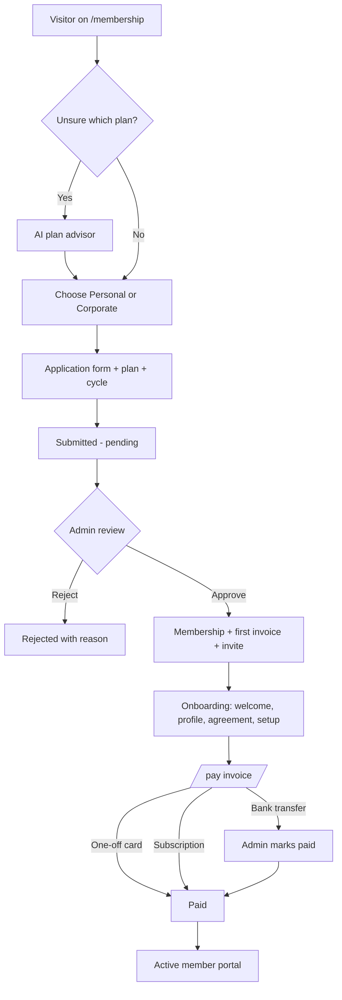
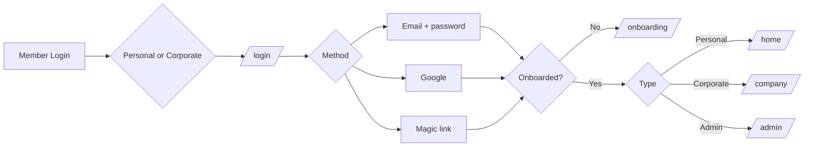
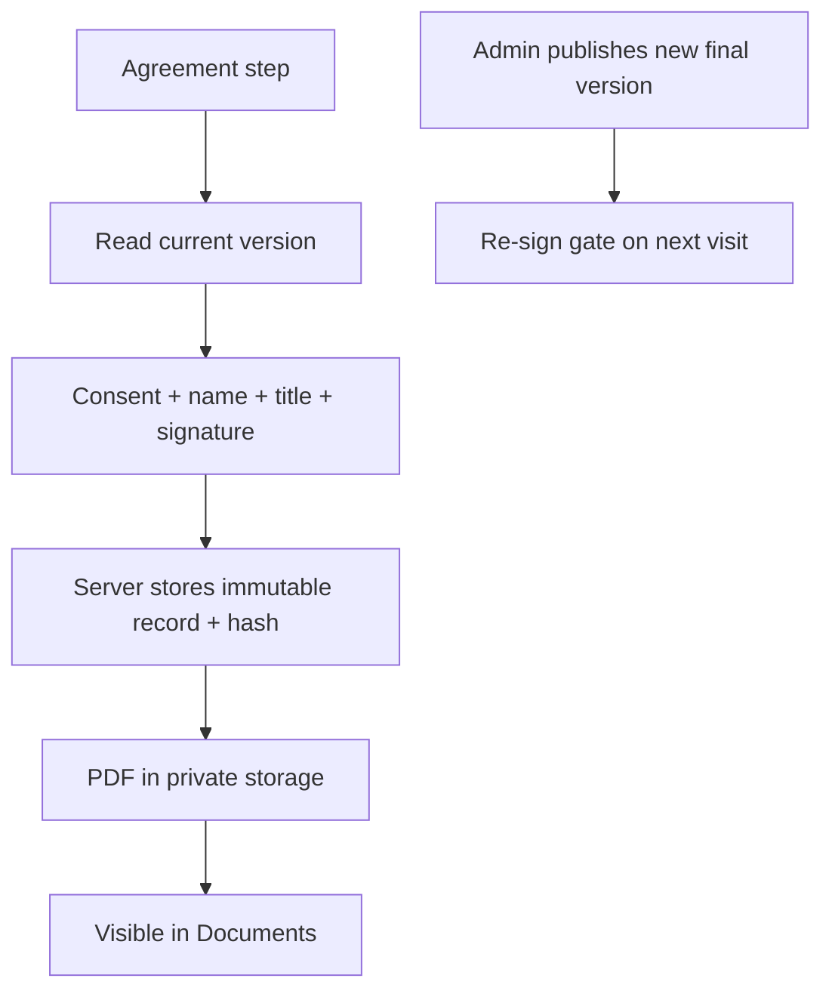
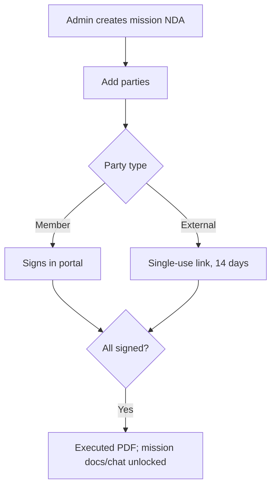
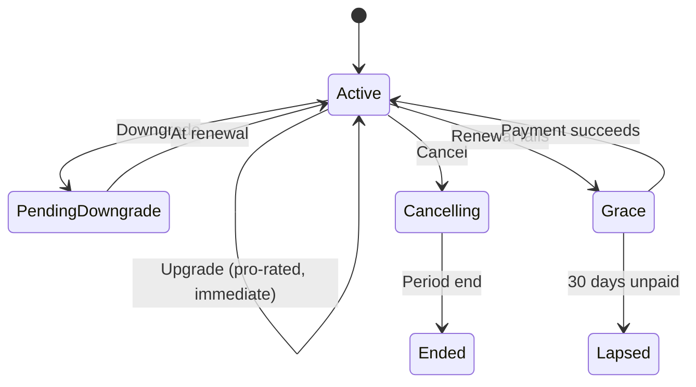
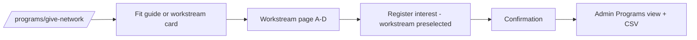
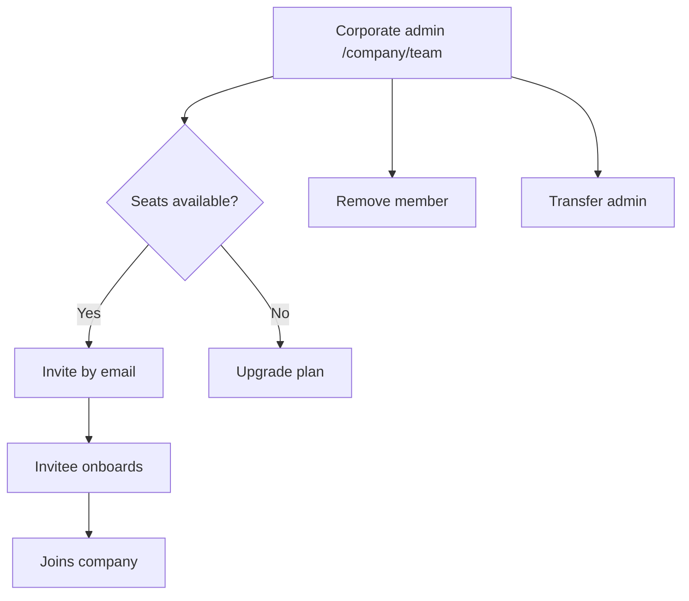
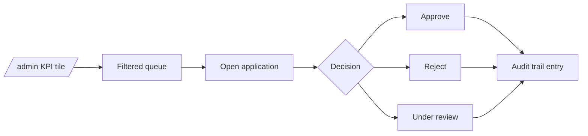

# 04 — User Flows

## 1. Membership application to active member

## 2. Sign in

## 3. Agreement e-signing

## 4. Engagement NDA

## 5. Subscription lifecycle

## 6. Give Network interest

## 7. Corporate team management

## 8. Admin review queue

